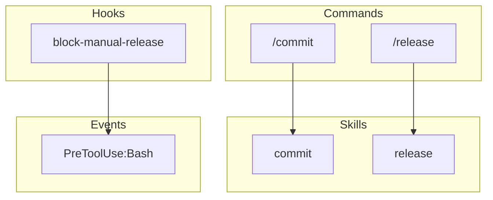

# Output Formats

## Mermaid Diagram

Generate a Mermaid flowchart showing relationships:



## Default (Terminal-Friendly)

Optimized for Claude Code's output window. Uses Unicode box characters, aligned columns, and visual grouping. **All data is read dynamically from the filesystem at invocation time.**

```text
╭──────────────────────────────────────────────────────────────────────────────╮
│  {plugin.name} v{plugin.version}                                             │
│  {plugin.description}                                                        │
╰──────────────────────────────────────────────────────────────────────────────╯

COMPONENTS
────────────────────────────────────────────────────────────────────────────────
  📁 Commands    {count}
  ⚡ Skills      {count}
  🪝 Hooks       {count} scripts (across {count} events)
  🤖 Agents      {count}

HOOK EVENTS
────────────────────────────────────────────────────────────────────────────────
  {event}   {count} handlers  matcher: {matcher}
  ...

ALL HOOKS
────────────────────────────────────────────────────────────────────────────────
  {event}  → {script.sh}
  ...

COMMANDS ({count})
────────────────────────────────────────────────────────────────────────────────
  {name}                     {description from frontmatter}
  {name}                     {description from frontmatter}
  ...

SKILLS ({count})
────────────────────────────────────────────────────────────────────────────────
  {name}                     {description from SKILL.md frontmatter}
  {name}                     {description from SKILL.md frontmatter}
  ...

AGENTS ({count})
────────────────────────────────────────────────────────────────────────────────
  {name}
    {description from agent frontmatter}
```

**Key:** All `{placeholders}` are replaced with values read from the filesystem at runtime.

## --markdown (GitHub/Docs)

Uses markdown tables and collapsible mermaid diagram:

```markdown
## Plugin Analysis: bluera-base v0.31.5

| Type | Count |
|------|-------|
| Commands | 29 |
| Skills | 29 |
| Hooks | 12 |
| Agents | 1 |

<details>
<summary>Mermaid Diagram</summary>
(diagram)
</details>
```

## --mermaid (Diagram Only)

Outputs just the Mermaid flowchart for embedding in documentation.

## --json (Machine Readable)

Full JSON structure for programmatic use. See [dependency-graph.md](dependency-graph.md) for the complete JSON schema.
